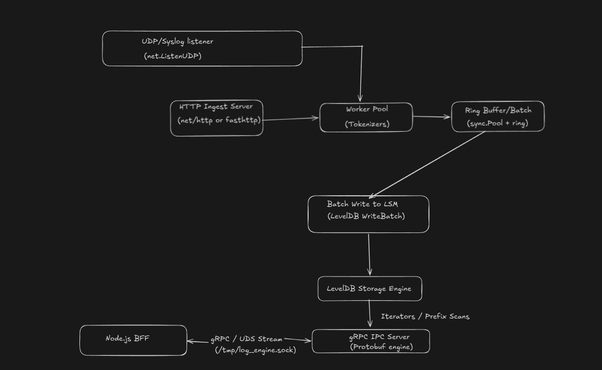

# Chronolog

Chronolog is a high-performance, real-time log aggregator and search interface. It accepts syslog and plain-text logs, tokenizes and indexes them in a Go/LevelDB engine, exposes search through a Node.js BFF, and renders results in a React frontend.

The project is designed as a Loki/Elasticsearch-style system:

Authentication is intentionally not part of this project. The server and frontend expose the log workflow directly.

## Original design decisions

These are the project decisions carried forward from the original Chronolog design record:

1. **Go handles the heavy path.** Go is responsible for high-volume ingestion, RFC syslog parsing, tokenization, worker-pool processing, batching, LevelDB writes, and low-latency search.
2. **Node.js is the frontend-facing BFF.** Node.js owns HTTP validation, protobuf/gRPC client integration, JSON responses, and WebSocket delivery to the browser. It keeps frontend concerns separate from the write-heavy Go process.
3. **LevelDB was chosen for the storage workload.** Its MemTables and append-only WALs turn bursts into sequential writes; sorted SSTables support large indexes without loading B-tree branches into memory; concurrent reads avoid SQLite's single-writer lock; Snappy/block compression reduces repetitive log storage; and retention can be handled through compaction/SSTable expiry rather than blocking delete/vacuum cycles.
4. **IPC uses gRPC over a Unix-domain socket.** The typed protobuf contract replaced custom socket framing and gives the Node process a stable `Query` contract plus finite server-side `StreamQuery` support at `/tmp/log_engine.sock`.

The implementation decisions behind those choices are also intentional:

- Reusable buffers and a worker queue keep network reception separate from storage work.
- Batches flush at 2,500 items or every 15 ms in the current engine.
- Raw records use `0x01 | stream ID | timestamp`; inverted entries use `0x02 | term | 0x00 | timestamp | stream ID` with big-endian fields for ordered range scans.
- The in-memory inverted index handles hot logs while LevelDB handles historical queries.
- Search deduplicates records with primitive `(streamID, timestamp)` keys and preallocates result capacity to reduce garbage-collection pressure.
- The Node live-tail bridge polls the existing finite `Query` RPC because the current Go `StreamQuery` method is not a long-lived subscription. The browser receives only newly observed records and reconnects after transport failures.

## Repository layout

| Path | Purpose |
| --- | --- |
| `engine/` | Go ingestion, tokenization, LevelDB storage, search, and gRPC service. Treat this core as complete. |
| `server/` | Node.js API/BFF, dynamic protobuf client, and WebSocket live-tail bridge. |
| `web/` | React/Vite search and live-tail interface. |
| `scripts/` | Local development helpers and mocks. |

## Architecture

### Go engine

The Go engine owns the write-heavy and latency-sensitive work:

1. HTTP and UDP listeners receive logs.
2. RFC 3164 parsing extracts priority, severity, hostname, and message data.
3. A worker pool tokenizes messages and de-duplicates terms per log line.
4. Raw records and inverted-index entries are accumulated into LevelDB batches.
5. A memory index serves hot terms while LevelDB handles persisted search.

The engine listens on:

- `POST http://localhost:8080/ingest` for line-delimited text or syslog messages.
- UDP `localhost:5140` for syslog datagrams.
- Unix-domain gRPC socket `/tmp/log_engine.sock` for search RPCs.

The current engine implementation uses a 2,500-item batch threshold and a 15 ms flush timer. It stores raw records and term postings using big-endian keys so LevelDB range scans remain ordered.

### gRPC contract

The protobuf contract is duplicated in `engine/proto/logservice.proto` and `server/proto/logservice.proto` and contains:

- `Query(QueryRequest) returns (QueryResponse)` for one-shot search.
- `StreamQuery(QueryRequest) returns (stream LogEntry)` for finite server-side result streaming.

The Node client loads the server-side protobuf definition dynamically and connects to `unix:///tmp/log_engine.sock` by default. Override it with `GRPC_TARGET` when running the services on another transport.

The current Go `LogEntry` response contains a timestamp field that is not populated by the existing engine RPC implementation. The frontend therefore uses the engine timestamp when available and receipt time as a display fallback.

### Search path

~~~text
React query bar
    │ GET /api/logs/search?term=...&startTime=...&endTime=...&limit=...
    ▼
Node validates query parameters and converts milliseconds to nanoseconds
    │ gRPC Query over Unix socket
    ▼
Go memory index + LevelDB inverted index
    │
    ▼
Node maps protobuf response to JSON
    │
    ▼
React normalizes and displays log entries
~~~

The frontend accepts a Loki-like query format such as:

~~~text
{app="nginx", env="prod"} | "error"
~~~

The first text term is sent to the Go engine. Label selectors are applied to normalized results in the frontend because the current protobuf request supports one search term and no label map.

### Live tail

The browser opens:

~~~text
ws://localhost:3001/ws/logs?term=error
~~~

The Node WebSocket bridge polls the existing Go `Query` RPC over a bounded recent-time window, emits newly observed records, and sends status frames:

~~~json
{ "type": "status", "state": "connecting" }
{ "type": "status", "state": "connected" }
{ "type": "log", "log": { "message": "..." } }
{ "type": "error", "error": "..." }
~~~

This polling bridge is intentional: the Go `StreamQuery` RPC is finite-result streaming, not a long-lived subscription. The browser reconnects after a dropped connection and closes the socket and timers when Live Tail is disabled.

## Requirements

- Go 1.26.4 or newer
- Node.js 20 or newer
- npm
- Linux/macOS for the default Unix-domain socket path

## How to run locally

Open three terminals from the repository root.

### 1. Start the Go engine

~~~bash
cd engine
go mod download
go run ./cmd/server
~~~

The engine creates its LevelDB data under `engine/data/leveldb`, listens for ingestion on ports `8080` and `5140`, and creates `/tmp/log_engine.sock`.

### 2. Start the Node.js server

~~~bash
cd server
npm install
npm start
~~~

The BFF listens on `http://localhost:3001` and connects to the Go socket automatically.

Useful environment variables:

~~~bash
PORT=3001
GO_SOCKET_PATH=/tmp/log_engine.sock
GRPC_TARGET=unix:///tmp/log_engine.sock
LIVE_POLL_MS=400
~~~

### 3. Start the React frontend

~~~bash
cd web
npm install
npm run dev
~~~

Open http://localhost:5173. Vite proxies `/api` and `/ws` to the Node server.

## Ingest and search manually

Ingest one syslog line over HTTP:

~~~bash
curl -X POST http://localhost:8080/ingest \
  --data-binary '<34>Sep 24 16:15:00 api-gw router: Upstream connection timeout to /checkout'
~~~

Search through the Node API:

~~~bash
curl 'http://localhost:3001/api/logs/search?term=timeout&startTime=0&endTime=4102444800000&limit=20'
~~~

### Continuous live-tail demo

The 100,000-record benchmark is a historical load test. It does not continuously produce new records for the WebSocket. Start this producer in another terminal:

~~~bash
bash scripts/live_demo.sh
~~~

Then set the frontend query to `chronologdemo`, enable **Live Tail**, and new records should appear approximately every 500 ms. Adjust the rate or stop after a fixed number of messages:

~~~bash
INTERVAL=0.1 COUNT=1000 bash scripts/live_demo.sh
~~~

The existing benchmark data can be searched with `timeout`:

~~~bash
curl 'http://localhost:3001/api/logs/search?term=timeout&startTime=0&endTime=4102444800000&limit=20'
~~~

Send a UDP syslog datagram:

~~~bash
printf '<34>Sep 24 16:15:00 api-gw router: database timeout\n' \
  | nc -u -w1 localhost 5140
~~~

Check service health:

~~~bash
curl http://localhost:3001/health
~~~

Expected response:

~~~json
{"status":"ok"}
~~~

## Verification and tests

Run the Go tests:

~~~bash
cd engine
go test ./...
~~~

Run the search benchmark:

~~~bash
cd engine
go test -bench=BenchmarkSearchTerm -benchmem ./internal/search
~~~

Run the ingestion benchmark:

~~~bash
cd engine
go run ./cmd/bench_ingest
~~~

Run the gRPC query benchmark:

~~~bash
cd engine
go run ./cmd/bench_query
~~~

Validate the Node server:

~~~bash
cd server
npm test
~~~

Build and lint the frontend:

~~~bash
cd web
npm run build
npm run lint
~~~

For an end-to-end smoke test, ingest a log, query the Node endpoint for a unique term, then enable Live Tail in the UI and ingest another matching log. The new message should appear without refreshing the page. Toggle Live Tail off and on repeatedly to verify the socket is closed and re-established cleanly.

## Performance notes

The engine is optimized around append-heavy log workloads:

- LevelDB provides write batching, WAL durability, sorted SSTables, and concurrent reads.
- The memory index serves recently ingested terms without waiting for persistent range scans.
- Inverted keys are structured for ordered term and time lookups.
- Query result capacity and deduplication structures are pre-sized to reduce allocations.

The original project notes reported representative query measurements of approximately 203 µs average latency, 189 µs P50, 236 µs P90, and 469 µs P99. Treat these as benchmark observations rather than service-level guarantees; rerun the benchmark on the target machine before making capacity decisions.

## Operational notes

- Do not start two engine processes at once; they will compete for port `8080`, UDP `5140`, and `/tmp/log_engine.sock`.
- If the engine exits unexpectedly, remove only the stale socket file before restarting:

~~~bash
rm -f /tmp/log_engine.sock
~~~

- The server returns `502` when the Go engine cannot answer a query and `400` for invalid query parameters.
- The frontend shows an empty/error state when the engine is unavailable; it does not fabricate search or live-tail records.
